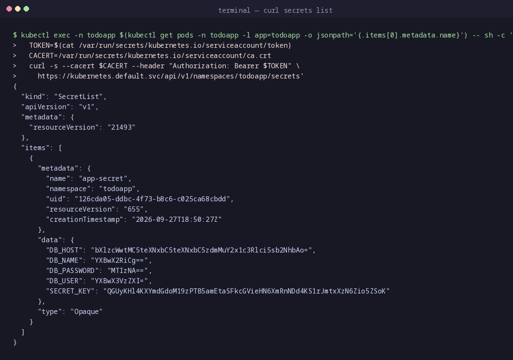

# Validation Instructions

This document describes how to validate the RBAC configuration and verify that the `Deployment` pod can list secrets in the `todoapp` namespace.

---

## 1. Apply Manifests

Ensure the Kubernetes cluster is running and apply the RBAC resources and the deployment:

```bash
kubectl apply -f security/rbac
kubectl apply -f .infrastructure/app/deployment.yml
```

---

## 2. Verify RBAC Resources

Verify that the `ServiceAccount`, `Role`, and `RoleBinding` were created in the `todoapp` namespace:

```bash
kubectl get serviceaccount,role,rolebinding -n todoapp
```

Expected output includes:
- `serviceaccount/secrets-reader`
- `role.rbac.authorization.k8s.io/secrets-reader-role`
- `rolebinding.rbac.authorization.k8s.io/secrets-reader-binding`

---

## 3. Verify Deployment Pod ServiceAccount

Check that the pod running in the `todoapp` namespace is using the `secrets-reader` ServiceAccount:

```bash
kubectl get pods -n todoapp
```

Pick one running pod name (e.g., `todoapp-<hash>`) and check its service account:

```bash
kubectl describe pod <POD_NAME> -n todoapp | grep "Service Account"
```

Expected output:
```text
Service Account:  secrets-reader
```

---

## 4. Test Listing Secrets from inside the Pod

Execute a `curl` request to the Kubernetes API server from within the running application pod using the mounted service account token and CA certificate:

```bash
kubectl exec -n todoapp $(kubectl get pods -n todoapp -l app=todoapp -o jsonpath='{.items[0].metadata.name}') -- sh -c '
TOKEN=$(cat /var/run/secrets/kubernetes.io/serviceaccount/token)
CACERT=/var/run/secrets/kubernetes.io/serviceaccount/ca.crt
curl -s --cacert $CACERT --header "Authorization: Bearer $TOKEN" \
  https://kubernetes.default.svc/api/v1/namespaces/todoapp/secrets
'
```

### Expected Output

A JSON response containing the list of secrets in the `todoapp` namespace:

```json
{
  "kind": "SecretList",
  "apiVersion": "v1",
  "metadata": {
    "resourceVersion": "..."
  },
  "items": [
    {
      "metadata": {
        "name": "app-secret",
        "namespace": "todoapp",
        ...
      },
      ...
    }
  ]
}
```

---

## 5. Screenshot of Validation Output


